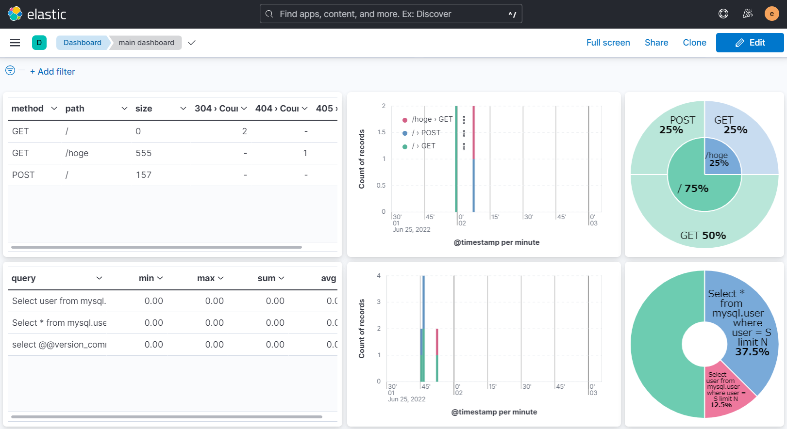

# isucon-dashboard

EFK(Elasticsearch, Fluent Bit, Kibana) dashboard for [ISUCON](https://isucon.net/)



```txt
Nginx(s),Slow query log(s)
-> Fluent Bit(s)
-> Fluent Bit
-> Elasticsearch
-> Kibana
```

## (Optional) Nginx settings

Add `$request_time` to log_format

```txt
log_format  main  '$remote_addr - $remote_user [$time_local] "$request" '
                  '$status $body_bytes_sent "$http_referer" '
                  '"$http_user_agent" "$http_x_forwarded_for" $request_time';
```

## Quick start

1. start EFK server (with Docker)

```bash
cd server
docker compose up --build
```

2. open another shell & start client

- with Docker

```bash
cd client
docker compose up --build
```

- without Docker (local)
  - **If you use this dashboard for ISUCON, use this method.**
  - Fluent Bit is required
    - install from [official method](https://docs.fluentbit.io/manual/installation/getting-started-with-fluent-bit)

```bash
cd client
git clone git@github.com:tetoraorg/isucon-setup.git /tmp/isucon-setup
cp /tmp/isucon-setup/fluent-bit .
export DASHBOARD_HOST={{hostname of dashboard}} # default is localhost
fluent-bit -c ./fluent-bit/fluent-bit.conf
```

## Example

### Nginx

```bash
curl localhost
```

### Slow query log

make sure turning on [Slow query log](./client/mysql/slow.cnf)

```sql
# in mysql
SELECT SLEEP(1);
```
